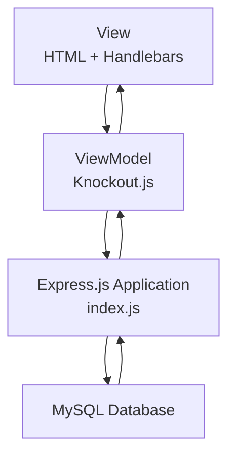

# Node.js CRUD Application (MVVM Architecture)

A simple CRUD application built with **Node.js**, **Express.js**, **Knockout.js**, **MySQL**, and **Handlebars (HBS)** using the **MVVM (Model–View–ViewModel)** architectural pattern. This project demonstrates how to separate business logic, presentation, and data access while keeping the codebase simple, maintainable, and easy to understand.

---

## Features

* CRUD (Create, Read, Update, Delete)
* MVVM Architecture
* RESTful API
* MySQL Database
* Knockout.js Data Binding
* Express.js Routing
* Handlebars (HBS) View Engine
* Responsive Frontend
* Server-side Rendering
* JSON API Response

---

# Technology Stack

| Layer          | Technology       |
| -------------- | ---------------- |
| Backend        | Node.js          |
| Framework      | Express.js       |
| Frontend       | Knockout.js      |
| View Engine    | Handlebars (HBS) |
| Database       | MySQL            |
| Date Library   | Moment.js        |
| Utility        | DateFormat       |
| Request Parser | Body Parser      |

---

# Dependencies

```json
{
  "express": "^4.16.3",
  "mysql": "^2.16.0",
  "body-parser": "^1.18.3",
  "hbs": "^4.0.1",
  "moment": "^2.24.0",
  "dateformat": "^3.0.3"
}
```

---

## MVVM-Based Architecture



### Architecture Overview

The frontend follows the MVVM (Model–View–ViewModel) pattern using Knockout.js for two-way data binding and UI state management.

On the backend, Express.js provides routing and business logic in a lightweight structure. For simplicity, the current implementation centralizes routing, controller logic, and SQL queries within a single `index.js` file, making it suitable for learning purposes and small CRUD applications.

### Project Components

#### Express.js Application

Responsible for:

* Routing HTTP requests
* Executing SQL queries
* Performing CRUD operations
* Returning HTML or JSON responses

---

#### View

* HTML
* Handlebars (HBS)
* User Interface

---

#### ViewModel

Implemented using Knockout.js.

Responsible for:

* Observable data
* Two-way data binding
* AJAX communication
* UI state management


---

## Request Flow

```text
Browser
    │
    ▼
Knockout.js ViewModel
    │
    ▼
AJAX / HTTP Request
    │
    ▼
Express.js Application (index.js)
    │
    ▼
MySQL Database
    │
    ▼
JSON / HTML Response
    │
    ▼
Knockout.js Updates the UI
    │
    ▼
Browser
```

### Request Lifecycle

1. The user interacts with the web interface.
2. Knockout.js captures user actions and prepares the request.
3. An HTTP request is sent to the Express.js application.
4. Express.js processes the request and executes the required SQL queries.
5. MySQL returns the requested data.
6. Express.js sends a JSON or rendered HTML response back to the client.
7. Knockout.js automatically updates the user interface using observable bindings.


---

# Project Structure

```
project/
│
├── public/                 # Static assets (CSS, JavaScript, Images)
│   ├── css/
│   ├── js/
│   └── images/
│
├── views/                  # Handlebars (HBS) templates
│
├── db_node_crud.sql        # MySQL database schema
├── index.js                # Main application entry point
├── package.json            # Project dependencies
├── package-lock.json       # Dependency lock file
└── README.md               # Project documentation
```

### Directory Overview
```
| File / Directory      | Description                                                                          |
| --------------------- | ------------------------------------------------------------------------------------ |
| **public/**           | Contains static assets such as CSS, JavaScript, and images.                          |
| **views/**            | Contains Handlebars (`.hbs`) templates for rendering the user interface.             |
| **db_node_crud.sql**  | MySQL database schema and sample data for the application.                           |
| **index.js**          | Main entry point of the Express.js application, including routes and business logic. |
| **package.json**      | Defines project metadata and Node.js dependencies.                                   |
| **package-lock.json** | Locks dependency versions for consistent installations.                              |
| **README.md**         | Project documentation and setup guide.                                               |

```

---

# Application Workflow

```
User

 │

 ▼

Open Browser

 │

 ▼

Knockout.js

 │

 ▼

Fill Form

 │

 ▼

AJAX

 │

 ▼

Express.js

 │

 ▼

Controller

 │

 ▼

Model

 │

 ▼

MySQL

 │

 ▼

JSON

 │

 ▼

Knockout Observable

 │

 ▼

View Updated Automatically
```

---

# Installation

Clone the repository

```bash
git clone https://github.com/username/project.git
```

Install dependencies

```bash
npm install
```

Configure MySQL connection.

Start the application.

```bash
node app.js
```

Open your browser.

```
http://localhost:8000
```

---

# Why MVVM?

Using MVVM provides several advantages:

* Better separation of concerns
* Easier code maintenance
* Reusable ViewModel logic
* Cleaner frontend architecture
* Automatic UI updates using Knockout Observables
* Easier debugging and testing

---

# Advantages

* Lightweight architecture
* Beginner-friendly project
* Easy to extend
* Clean folder organization
* Suitable for learning Node.js + MySQL
* Demonstrates MVVM with Knockout.js
* Simple REST API implementation
* Good starting point for enterprise applications

---

# License

This project is intended for educational purposes and serves as a simple reference implementation of the **MVVM architectural pattern** using Node.js, Express.js, Knockout.js, and MySQL.
